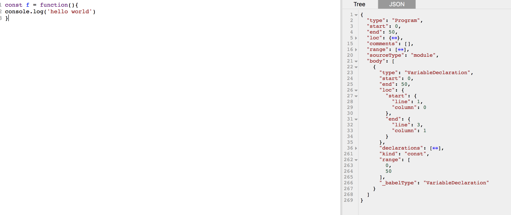

#### 一篇文章轻松入门 bael 插件开发

> 有了 bebel 这个巨人的肩膀，如今处理代码转换不再是那么的困难，我们不再需要掌握太深的编译原理知识，只需要掌握基础 AST（抽象语法树）知识，并运用相关 babel api 在语法树上修改即可。本文将从如何快速入门 babel 插件开发到实现一个 seajs 风格模块转换为 es modules 模块的转换工具来讲述。

何为 AST？

引用维基百科上的解释

> 在计算机科学中，抽象语法树（Abstract Syntax Tree，AST），或简称语法树（Syntax tree），是源代码语法结构的一种抽象表示。它以树状的形式表现编程语言的语法结构，树上的每个节点都表示源代码中的一种结构。之所以说语法是“抽象”的，是因为这里的语法并不会表示出真实语法中出现的每个细节。

对于 javascript 中的实际例子，我们可以到[https://astexplorer.net/](https://astexplorer.net/)查看一段代码具体的 AST 长什么样子。如下一段简单的 js 代码转换成 AST 树就是这个样子


要实现 seajs 转 es6 模块，具体要对以下几种情况进行处理

1、define 的回调函数提取到最外

```javascript
define("module", function(require, exports, module) {
    // 需要提取到外部
});
```

2、模块引入,模块引入分几种

```javascript
// 假设当前在 module/d下

// 绝对路径引入
const a = require("module/a");

// 相对路径引入
const b = require("./b");

// 本页面外部模块引入
const $ = require("jquery");

// 作为对象的值引入
const moduleObj = {
    a : require("module/a");
}

// 导入直接传递，类似上面
const f=()=>{}
f(require("module/a"))

// 同一模块多次require。只import一遍
//...

// 在局部范围内引入，提取到最外部import需要考虑到变量声明是否已经被占用的问题
// ...
```

3、模块导出

```javascript
// 普通默认导出
module.exports = {};

// 这种导出
exports.a = "hello";

// 表达式
let m = (module.exports = {});

// 连续赋值
let n;
let m = (n = module.exports = {});
```
